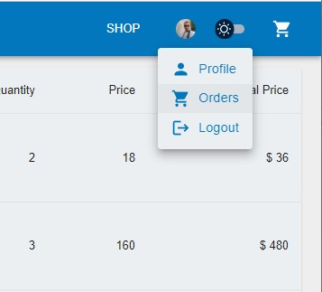

# Cimenoglu Giyim App

This is a web application for the clothing brand "Cimenoglu Giyim." It allows customers to browse and purchase products, view the latest collections and promotions, and stay up-to-date with the latest news from the company.

## Features

- Browse and purchase products
- View the latest collections and promotions
- Stay up-to-date with the latest news
- Create an account and save your favorite products
- Easy checkout process

## Technology stack

- React.js
- Material-UI
- Firebase
- Redux
- React-router-dom-v6
- Bootstrap
- Carousel

## Getting started

1. Clone the repository: `git clone https://github.com/ziyacaylan/cimenoglu-giyim-app.git`
2. Install dependencies: `npm install` or `yarn install`
3. Run the app: `npm start` or `yarn start`

## Contributions

Contributions are welcome. Please feel free to submit pull requests or open issues.

## Page Images

